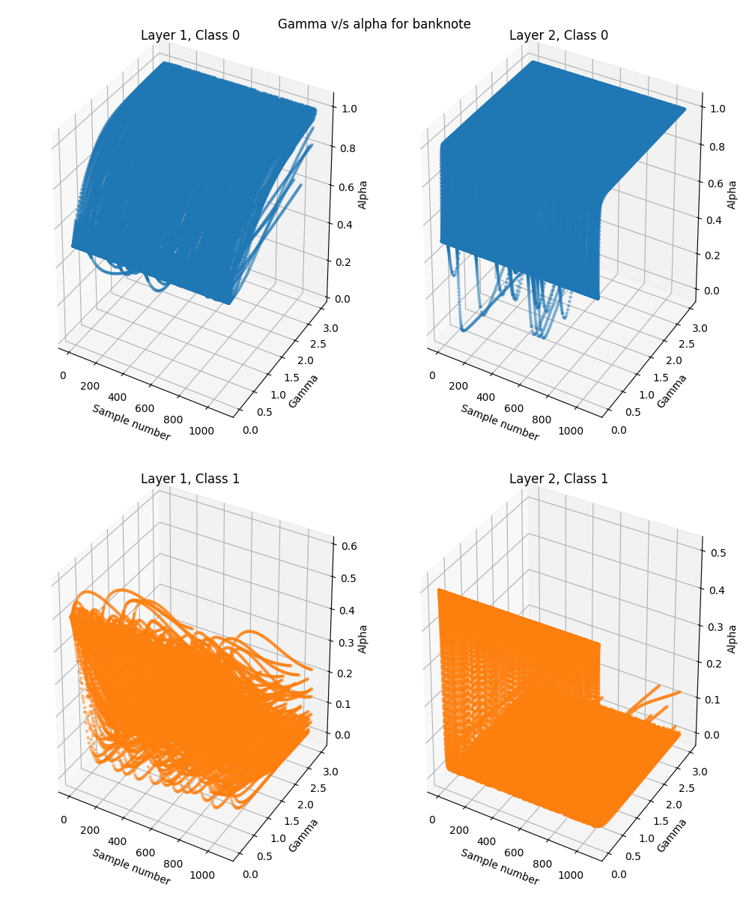
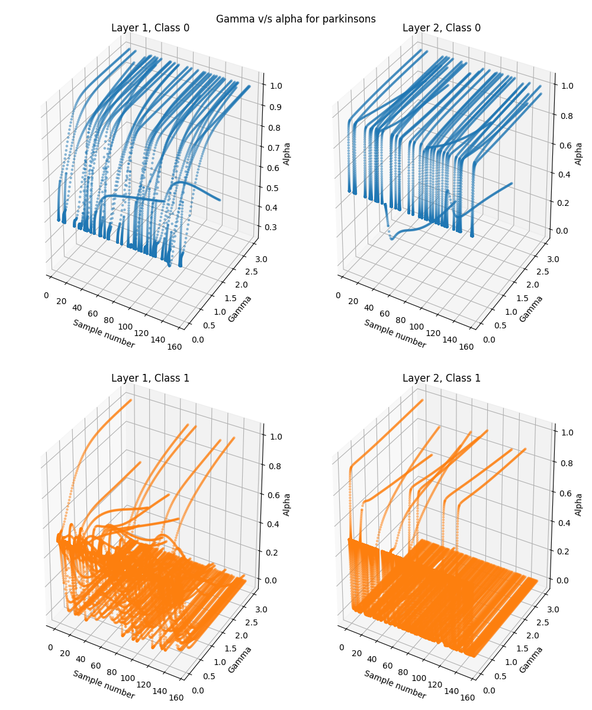
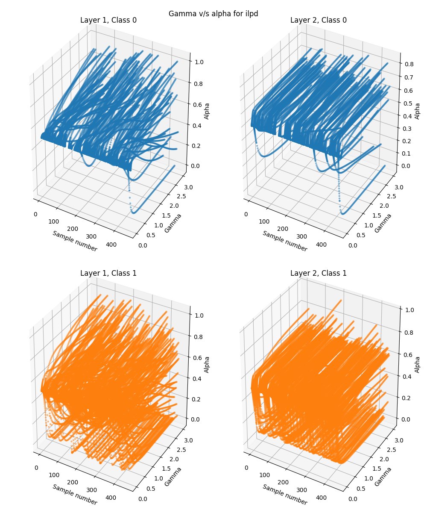
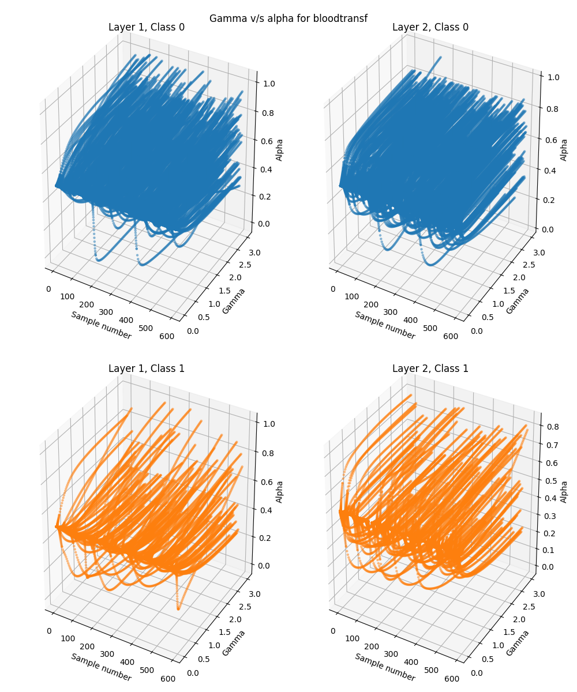
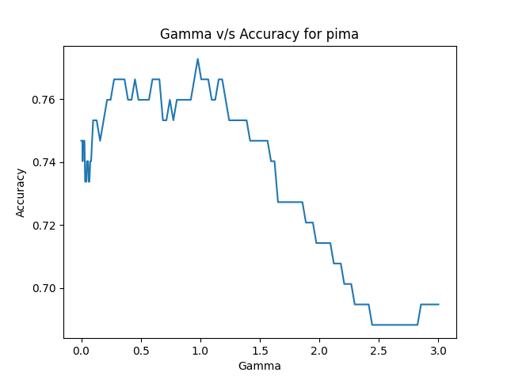
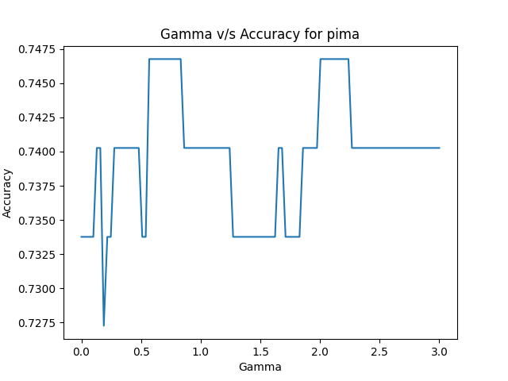

# Summary
This project develops and uses a novel binary classification -  supervised learning technique and compares its performance other standard machine learning techniques. The method used here is referred to as alpha splaying and its implementation can be found in `src/AlphaSplayer.py`. The implemented technique is feed-forward in that it doesn't use update procedures or loss functions to improve the classification metrics. 

# Dataset Description
For this project, we will be using 9 well known - openly available classification datasets. Since the method developed in this project uses a decision boundary separating two clusters, we're using binary classification datasets. Note that the Wine dataset used here originally has 3 classes, but for this project, we're only considering the first two classes.

## Dataset:  [Arrhythmia](https://archive.ics.uci.edu/ml/datasets/Arrhythmia)

This dataset consists of mainly linear valued attributes extracted from electro-cardiograms and labels indicating normal values and 15 types of arrhythmia. The 15 arrhythmia classes were reduced to one, which leaves us with a binary classification dataset with labels indicating presence of arrhythmia and normal behaviour.

Number of attributes: 274 
Number of records: 452 
Num Class 0: 245 
Num Class 1: 207

### AUC Values

| Feature      |     AUC |
|:-------------|--------:|
| Feature #4   | 0.68621 |
| Feature #193 | 0.68375 |
| Feature #161 | 0.32691 |
| Feature #163 | 0.33578 |
| Feature #191 | 0.66349 |
| Feature #271 | 0.34311 |
| Feature #273 | 0.34369 |
| Feature #173 | 0.34795 |
| Feature #171 | 0.36207 |
| Feature #201 | 0.36603 |
--------------------------------------------------
## Dataset:  [Bank note authentication](https://archive.ics.uci.edu/ml/datasets/banknote+authentication)

Consists of data extracted using Wavelet transform from images of bank notes to determine if the notes were genuine or forged. The data consists of continuous real valued attributes and two classes (real or forged).

Number of attributes: 4 
Number of records: 1372 
Num Class 0: 762 
Num Class 1: 610

### AUC Values
| Feature    |     AUC |
|:-----------|--------:|
| Feature #0 | 0.07267 |
| Feature #1 | 0.25077 |
| Feature #2 | 0.53578 |
| Feature #3 | 0.48097 |
--------------------------------------------------
## Dataset:  [Blood Transfusion Service Center](http://archive.ics.uci.edu/ml/datasets/Blood+Transfusion+Service+Center)

Data representing blood donation recency, frequency, volume, and time since first donation of donors at a university. The class labels represent whether of not the person donated blood in March 2007.

Number of attributes: 4 
Number of records: 748 
Num Class 0: 570 
Num Class 1: 178 

### AUC Values
| Feature    |     AUC |
|:-----------|--------:|
| Feature #0 | 0.30212 |
| Feature #1 | 0.64576 |
| Feature #2 | 0.64576 |
| Feature #3 | 0.48097 |
--------------------------------------------------
## Dataset:  [Breast Cancer Wisconsin (Diagnostic)](https://archive.ics.uci.edu/ml/datasets/Breast+Cancer+Wisconsin+(Diagnostic))

Consists of features describing the characteristics of cell nuclei extracted from fine needle aspirate of breast masses. The first attribute is ID number, which shouldn't be used for classification and was removed before computing AUC values and analyses. The remaining attributes are real valued features. The labels describe if the tissue is malignant or benign.

Number of attributes: 30 
Number of records: 569 
Num Class 0: 357 
Num Class 1: 212

### AUC Values
| Feature     |     AUC |
|:------------|--------:|
| Feature #22 | 0.97545 |
| Feature #20 | 0.97044 |
| Feature #23 | 0.96983 |
| Feature #27 | 0.9667  |
| Feature #7  | 0.96444 |
| Feature #2  | 0.9469  |
| Feature #3  | 0.93832 |
| Feature #6  | 0.93783 |
| Feature #0  | 0.93752 |
| Feature #13 | 0.92641 |
--------------------------------------------------
## Dataset:  [ILPD (Indian Liver Patient Dataset)](https://archive.ics.uci.edu/ml/datasets/ILPD+%28Indian+Liver+Patient+Dataset%29)

Classification dataset to determine if a given patient record, consisting of age, gender, and 8 biomarkers belong to a liver patient or not.

Number of attributes: 10 
Number of records: 579 
Num Class 0: 165 
Num Class 1: 414

### AUC Values
| Feature    |     AUC |
|:-----------|--------:|
| Feature #6 | 0.69696 |
| Feature #2 | 0.6936  |
| Feature #3 | 0.68755 |
| Feature #5 | 0.68479 |
| Feature #4 | 0.67205 |
| Feature #9 | 0.38005 |
| Feature #8 | 0.39327 |
| Feature #0 | 0.57968 |
| Feature #1 | 0.46142 |
| Feature #7 | 0.47974 |
--------------------------------------------------
## Dataset:  [Ionosphere](https://archive.ics.uci.edu/ml/datasets/Ionosphere)

The data represents radar signals collected from Goose Bay, Labrador. The signals were targeted for free electrons in the ionosphere, and "good" (represented by 'g') signals show evidence of some type of structure in the ionosphere. "Bad" signals (represented by 'b') pass through the ionosphere. A signal represented by $C(t) = A(t) + iB(t)$ is passed through an autocorrelation function described [here][2], which results in 17 complex values. The 34 attributes are created by separating the real and imaginary values of these complex numbers.

Number of attributes: 34 
Number of records: 351 
Num Class 0: 126 
Num Class 1: 225

### AUC Values
| Feature     |     AUC |
|:------------|--------:|
| Feature #2  | 0.70451 |
| Feature #6  | 0.68646 |
| Feature #26 | 0.32139 |
| Feature #4  | 0.67859 |
| Feature #0  | 0.65079 |
| Feature #32 | 0.63829 |
| Feature #30 | 0.63511 |
| Feature #8  | 0.62469 |
| Feature #7  | 0.60686 |
| Feature #14 | 0.60436 |
--------------------------------------------------
## Dataset:  [Parkinson's](https://archive.ics.uci.edu/ml/datasets/Parkinsons)

Created by Max Little of the University of Oxford, this dataset has a range of measurements extracted from speech signals of people with and without Parkinson's disease. The second attribute represents the subject name and recording number, which were not required for this project and were removed prior to any analyses.

Number of attributes: 22 
Number of records: 195 
Num Class 0: 48 
Num Class 1: 147 

### AUC Values
| Feature     |     AUC |
|:------------|--------:|
| Feature #21 | 0.89697 |
| Feature #18 | 0.89697 |
| Feature #12 | 0.82589 |
| Feature #19 | 0.81363 |
| Feature #4  | 0.78897 |
| Feature #6  | 0.7872  |
| Feature #9  | 0.78508 |
| Feature #8  | 0.78274 |
| Feature #3  | 0.77771 |
| Feature #7  | 0.77742 |
--------------------------------------------------
## Dataset:  [Pima Indians Diabetes Database](https://www.kaggle.com/uciml/pima-indians-diabetes-database)

This consists of medical predictor variables, from female subjects of age 21 years and above, that indicate if the person has diabetes or not. The attributes are 6 discrete-continuous variables and 2 real valued variables. 

Number of attributes: 8 
Number of records: 768 
Num Class 0: 500 
Num Class 1: 268

### AUC Values
| Feature    |     AUC |
|:-----------|--------:|
| Feature #1 | 0.78813 |
| Feature #5 | 0.68757 |
| Feature #7 | 0.68694 |
| Feature #0 | 0.61951 |
| Feature #6 | 0.6062  |
| Feature #2 | 0.58646 |
| Feature #3 | 0.55363 |
| Feature #4 | 0.53786 |
--------------------------------------------------
## Dataset:  [Wine](https://archive.ics.uci.edu/ml/datasets/wine)

The data contains of 13 attributes obtained by performing chemical analysis of wines grown in a region of Italy, from three different cultivators. The labels represent the cultivator the wine originated from. For this project, only wines from cultivator 1 and 2 are analyzed.

Number of attributes: 13 
Number of records: 130 
Num Class 0: 71 
Num Class 1: 59

### AUC Values
| Feature     |     AUC |
|:------------|--------:|
| Feature #12 | 0.98663 |
| Feature #0  | 0.97386 |
| Feature #9  | 0.94677 |
| Feature #6  | 0.88553 |
| Feature #5  | 0.81308 |
| Feature #4  | 0.80723 |
| Feature #3  | 0.20828 |
| Feature #2  | 0.71365 |
| Feature #11 | 0.71067 |
| Feature #7  | 0.31475 |
--------------------------------------------------

# Details

## Introduction
Some of the commonly used machine learning - classification algorithms include k-nearest neighbours (KNN), Bayesian learners, support-vector machines (SVM),  random forests, and neural networks. Most of these models involve creating a decision boundary to separate two or more classes and often require custom parameters based on the dataset. The classification technique created in this project is based on the vector machine formulation created by Dr. Jacob Levman, which can be found [here][1]. The vector machine formulation works on the formula below.

[1]: https://idp.springer.com/authorize/casa?redirect_uri=https://link.springer.com/content/pdf/10.1007/s10278-013-9621-8.pdf&casa_token=YTKkJI5eP4AAAAAA:QWf_9wiQLdaHsk2C-CHL1N7ButskzDZckdNU9oKpeSp4hsyTGvitfTGNNtkFNR2OyUNvLhjP9Xg1A90

Eq 1: 

$$ class = sign(\alpha  \overline{e^{-\gamma |x_{pos_{m, n}} - x_{test_m}|^2}} - (1-\alpha)\overline{e^{-\gamma |x_{neg_{p, n}} - x_{test_p}|^2}}) $$

$x_{pos_{m, n}}$: $m$ positive class samples with $n$ measurements  
$x_{neg_{p, n}}$: $p$ negative class samples with $n$ measurements  
$x_{test_m}$: single test sample with $n$ measurements replicated in $m$ rows  
$x_{test_p}$: single test sample with $n$ measurements replicated in $p$ rows  
$\gamma$: kernel parameter for RBF 
$\alpha$: input bias ranging from 0 to 1  
$sign(x)=1\ if\ x>0;\ sign(x)=-1\ if\ x<0$

The class of the test sample would be assigned based on the sign of the value within the $sign()$ from the above equation. For a sample to be on the decision boundary, the value within $sign()$ would have to equal 0. So, we ca re-write the above equation as follows

Eq 2:

$$ \alpha = \frac {\overline{e^{-\gamma |x_{neg_{p, n}} - x_{test_m}|^2}}} {\overline{e^{-\gamma |x_{pos_{m, n}} - x_{test_m}|^2}} + \overline{e^{-\gamma |x_{neg_{p, n}} - x_{test_m}|^2}}}$$

<i> Note </i>
* Eq 1 uses a RBF kernel to assign the class of given testing data. Alternatively, we can use a linear kernel with the following alpha equation

$$ \alpha = \frac{\Sigma(1-\overline{(x_{neg_{p, n}} - x_{test_p})^2})} {\Sigma(1-\overline{(x_{pos_{m, n}} - x_{test_p})^2}) + \Sigma(1-\overline{(x_{neg_{p, n}} - x_{test_p})^2})}$$

Now, for a given set of training data and labels, a given testing input, and a given gamma value, we can determine at what value of $\alpha$ (alpha) will the testing input lie on the decision boundary. If we consider a sample from the training set as our testing sample, keeping the rest of the training set untouched, we can find the alpha value for that training sample. Further, if we repeat this for all samples in the training set individually, we can get the alpha value at which each of the samples would lie on the decision boundary. These alpha values can then be aggregated to obtain a final alpha value for the dataset and used in Eq1. However, this requires setting a fixed value for the $\gamma$ (gamma) parameter in the radial basis function (RBF) used in this classifier. As observed in SVMs, the gamma parameter varies among datasets and can lead to overfitting at high values and may not sufficiently separate the classes at low values. Some of the main influences on the gamma parameter are the number of dimensions in the input dataspace, the distribution of these features and how noisy they are. 

The goal of this project is to use a range of gamma values on any given dataset and generate the alpha values for each value of gamma. These alpha values are then used as the training data to generate a next set of alpha values, which are aggregated and used to predict the class of a testing sample using Eq 1.

## Implementation
The first part of the project is to create a model that accepts a training set and a range of gamma values and generates a bunch of alpha values for all training samples for each gamma value. This essentially results in a $num\_samples * num\_gamma\_values$ matrix/array. This is implemented in the class `AlphaSplayer` in `src/AlphaSplayer.py`. The `alpha_for_all()` function calculates the individual alpha values for each training sample to be on the decision boundary, keeping the rest of the training set unchanged, for all given values of gamma. Theoretically, we could aggregate the alpha values to set as the alpha for the dataset, but as mentioned earlier, we would have to select an appropriate gamma value.

Instead, we can train another instance of `AlphaSplayer` using the alpha values generated by the above mentioned instance and the original training labels. Naturally, the alpha values from this new instance can be used to train yet another instance of `AlphaSplayer` and so on. Ultimately, the goal is to have an instance whose gamma value can be set to a pre-fixed value, which works well for all datasets. Alternatively, we can use a linear kernel in the final instance so the predictions are independent of the gamma value. The class `StackedAlphaSplayer`, found in `src/AlphaSplayer.py` was created to facilitate this functionality. Each instance of the `AlphaSplayer` class is referred as a layer in the `StackedAlphaSplayer`.

The `predict()` method in the `StackedAlphaSplayer` class allows us to pick the prediction method for the model. The four available options are
* vote - calculates the prediction for each gamma value in the final layer and uses a vote to determine the final class
* gamma_select - allows the user to specify the gamma value for the prediction equation in the final layer. The default is 1/(var * num_features), which is the default gamma value used by the [sci-kit learn SVC][2].
* linear - used when the final layer is an `AlphaSplayer` with linear kernel, which doesn't use a gamma parameter
* return_all - returns the predictions for each gamma value in the final layer. It's the same as vote except the predictions are returned for all gamma values instead of the majority.

The gamma range used in all the models in this project was the following

`GAMMA_VALUES = np.sort(np.append(np.linspace(0.1, 3, 100), np.logspace(-5, -1, 100)))`

This generates 100 equally spaced points between 0.1 and 3.0, and combines it with 100 points between 10-5 and 10-1 equally spaced on the log scale.

[2]: https://scikit-learn.org/stable/modules/generated/sklearn.svm.SVC.html

<i>

### Note
* The `AlphaSplayer` class allows the user to use a linear kernel which only gives a $1 * num\_samples$ array as the gamma parameter has no influence there

* The `StackedAlphaSplayer` class auto updates the gamma values to remove cases where NaN values occur in the alpha values
</i>

## Alpha profiles
Considering just the alpha values from the first layer, there is a lot of change in alpha with respect to gamma for a majority of the datasets. There's also a considerable overlap between the alpha values of the positive and negative class. However, as we move through the layers, the alpha values start separating out. More accurately, the alpha values of the negative class (class 0) tend towards 1 and those of the positive class (class 1) tend towards 0. Going back to Eq 2, an alpha value of 1 would mean the term $\overline{e^{-\gamma |x_{pos_{m, n}} - x_{test_m}|^2}}$ is zero, implying that the Euclidean distance of the test sample from the positive class is infinity, which makes sense as it belongs to the negative class. On the other hand, an alpha value of 0 would mean the term $\overline{e^{-\gamma |x_{neg_{p, n}} - x_{test_m}|^2}}$ is zero, implying the Euclidean distance of the test sample from the positive class is infinity.

The separation of the alpha values can be best visualized by the 2 layered model for the Bank note authentication dataset and the Parkinson's dataset shown below.

    
    

However, this isn't always the case and some noisy datasets like the ILPD and Blood transfusion datasets can have very similar looking alpha profiles for parts of both the classes.

    
    

## Comparing against other models
To evaluate the `StackedAlphaSplayer`, we compare it against some [standard classifiers][3] available through the Sci-kit learn library. We use 5-fold stratified cross validation to get mean measures of the AUC and accuracy for each of the datasets mentioned in Q2. Two versions of the  `StackedAlphaSplayer` (abbreviated stas), are compared in this test - single layered, and 2 layered.  We use the <i>vote</i>, <i>gamma_select</i>, and the <i>linear</i> prediction options for both versions of the `StackedAlphaSplayer` to obtain the predictions.

[3]: https://scikit-learn.org/stable/auto_examples/classification/plot_classifier_comparison.html?highlight=classifiers

The evaluation results are shown below for each dataset. The models are sorted by highest mean accuracy first.

Stats for dataset arrhythmia
|                     |   mean_acc |   mean_auc |
|:--------------------|-----------:|-----------:|
| svm_rbf             |   0.763443 |   0.754372 |
| stas_vote_1         |   0.73011  |   0.725742 |
| mlp                 |   0.71685  |   0.712361 |
| rf_10               |   0.706007 |   0.697453 |
| svm_lin             |   0.670501 |   0.669678 |
| stas_linear_2       |   0.661514 |   0.642843 |
| stas_vote_2         |   0.65707  |   0.642716 |
| stas_linear_1       |   0.650427 |   0.636039 |
| rf_1                |   0.64359  |   0.642907 |
| stas_gamma_select_2 |   0.626276 |   0.600755 |
| stas_gamma_select_1 |   0.550891 |   0.50964  |
--------------------------------------------------

Stats for dataset banknote
|                     |   mean_acc |   mean_auc |
|:--------------------|-----------:|-----------:|
| svm_rbf             |   1        |   1        |
| mlp                 |   1        |   1        |
| stas_linear_2       |   0.995623 |   0.996057 |
| rf_10               |   0.991981 |   0.992129 |
| stas_gamma_select_2 |   0.989064 |   0.990153 |
| stas_vote_2         |   0.988334 |   0.989495 |
| stas_linear_1       |   0.986877 |   0.988184 |
| svm_lin             |   0.986147 |   0.98736  |
| rf_1                |   0.970123 |   0.96934  |
| stas_gamma_select_1 |   0.92129  |   0.920962 |
| stas_vote_1         |   0.878285 |   0.878813 |
--------------------------------------------------

Stats for dataset bloodtransf
|                     |   mean_acc |   mean_auc |
|:--------------------|-----------:|-----------:|
| svm_lin             |   0.760707 |   0.499123 |
| svm_rbf             |   0.759445 |   0.598425 |
| mlp                 |   0.736787 |   0.616617 |
| rf_10               |   0.672653 |   0.528183 |
| rf_1                |   0.640671 |   0.521149 |
| stas_gamma_select_2 |   0.611078 |   0.57637  |
| stas_vote_1         |   0.587043 |   0.629875 |
| stas_gamma_select_1 |   0.580367 |   0.633329 |
| stas_linear_1       |   0.549673 |   0.607055 |
| stas_vote_2         |   0.541682 |   0.580647 |
| stas_linear_2       |   0.539096 |   0.565192 |
--------------------------------------------------

Stats for dataset breastcancer
|                     |   mean_acc |   mean_auc |
|:--------------------|-----------:|-----------:|
| svm_rbf             |   0.973638 |   0.970417 |
| svm_lin             |   0.970144 |   0.964627 |
| mlp                 |   0.970144 |   0.967509 |
| stas_linear_2       |   0.964773 |   0.962272 |
| stas_gamma_select_2 |   0.956032 |   0.952351 |
| stas_vote_1         |   0.954293 |   0.951093 |
| stas_vote_2         |   0.952507 |   0.949535 |
| rf_10               |   0.950784 |   0.940714 |
| stas_linear_1       |   0.950769 |   0.949138 |
| stas_gamma_select_1 |   0.93678  |   0.919156 |
| rf_1                |   0.91919  |   0.913648 |
--------------------------------------------------

Stats for dataset ilpd
|                     |   mean_acc |   mean_auc |
|:--------------------|-----------:|-----------:|
| svm_lin             |   0.715022 |   0.5      |
| svm_rbf             |   0.711574 |   0.499416 |
| mlp                 |   0.682369 |   0.593866 |
| rf_10               |   0.644393 |   0.574574 |
| rf_1                |   0.644303 |   0.576355 |
| stas_linear_1       |   0.570165 |   0.643013 |
| stas_vote_1         |   0.568396 |   0.663641 |
| stas_vote_2         |   0.540765 |   0.633367 |
| stas_linear_2       |   0.525157 |   0.626071 |
| stas_gamma_select_2 |   0.523493 |   0.628591 |
| stas_gamma_select_1 |   0.507901 |   0.639536 |
--------------------------------------------------

Stats for dataset ionosphere
|                     |   mean_acc |   mean_auc |
|:--------------------|-----------:|-----------:|
| svm_rbf             |   0.948692 |   0.933795 |
| rf_10               |   0.931549 |   0.927265 |
| mlp                 |   0.925996 |   0.904188 |
| stas_linear_2       |   0.888934 |   0.861385 |
| stas_vote_2         |   0.874648 |   0.836051 |
| rf_1                |   0.869336 |   0.842581 |
| stas_linear_1       |   0.868934 |   0.831607 |
| svm_lin             |   0.866318 |   0.829846 |
| stas_gamma_select_2 |   0.86326  |   0.818427 |
| stas_vote_1         |   0.863179 |   0.839453 |
| stas_gamma_select_1 |   0.7066   |   0.591385 |
--------------------------------------------------

Stats for dataset parkinsons
|                     |   mean_acc |   mean_auc |
|:--------------------|-----------:|-----------:|
| svm_rbf             |   0.846154 |   0.697778 |
| mlp                 |   0.835897 |   0.716322 |
| svm_lin             |   0.8      |   0.688851 |
| rf_10               |   0.764103 |   0.625632 |
| rf_1                |   0.748718 |   0.60908  |
| stas_linear_2       |   0.748718 |   0.707931 |
| stas_linear_1       |   0.74359  |   0.739808 |
| stas_vote_2         |   0.74359  |   0.704483 |
| stas_gamma_select_2 |   0.733333 |   0.662605 |
| stas_gamma_select_1 |   0.712821 |   0.727126 |
| stas_vote_1         |   0.666667 |   0.765517 |
--------------------------------------------------

Stats for dataset pima
|                     |   mean_acc |   mean_auc |
|:--------------------|-----------:|-----------:|
| svm_lin             |   0.773483 |   0.725613 |
| svm_rbf             |   0.770894 |   0.721909 |
| mlp                 |   0.757881 |   0.713613 |
| rf_10               |   0.751337 |   0.691261 |
| stas_gamma_select_1 |   0.747466 |   0.706639 |
| stas_gamma_select_2 |   0.72925  |   0.719571 |
| stas_vote_1         |   0.721416 |   0.731495 |
| stas_linear_1       |   0.71881  |   0.717569 |
| stas_vote_2         |   0.717503 |   0.715717 |
| stas_linear_2       |   0.709702 |   0.727885 |
| rf_1                |   0.667948 |   0.638545 |
--------------------------------------------------

Stats for dataset wine
|                     |   mean_acc |   mean_auc |
|:--------------------|-----------:|-----------:|
| svm_rbf             |   0.992308 |   0.991667 |
| rf_10               |   0.984615 |   0.983333 |
| svm_lin             |   0.976923 |   0.977857 |
| mlp                 |   0.976923 |   0.977857 |
| stas_linear_1       |   0.961538 |   0.965238 |
| stas_vote_2         |   0.961538 |   0.965238 |
| stas_gamma_select_2 |   0.961538 |   0.965238 |
| stas_linear_2       |   0.961538 |   0.965238 |
| rf_1                |   0.946154 |   0.945238 |
| stas_vote_1         |   0.946154 |   0.950952 |
| stas_gamma_select_1 |   0.907692 |   0.915714 |
--------------------------------------------------

Overall, the `StackedAlphaSplayer` performs in the neighbourhood of the decision tree classifier. We see the worst performance of this classifier in the blood transfusion and ILPD datasets and this was expected as the alpha profiles of both the classes in these datasets are very noisy and have a lot of similarities between the two classes. For the most part, the model with 2 layers performs similar to if not better than the model with 1 layer. The <i> gamma_select </i> prediction method also seems to work better for a 2 layered model as opposed to a 1 layered model as at the second layer, the predictions across the gamma values are more consistent and it doesn't really matter what gamma value you choose for the prediction. 

For example, consider the gamma v/s accuracy plots for the PIMA dataset below. With the single layered approach, the accuracy ranges between ~0.76 and ~0.70 with big changes with change in gamma. However, adding the second layer constrains the accuracy between 0.7475 and 0.7295 and it is more stable with changes to gamma.

One layered model

Two layered model

We observe similar behaviour of gamma against accuracy for all the other datasets, and the plots can be found in `plots/gamma_accuracies/`.

To conclude, the `StackedAlphaSplayer` implements a feed forward learning model with no parameters being optimized to fit the training data. It performs close to the standard learning algorithms for the most part, which use some form of feedback or optimization. We could potentially use a different gamma range for each dataset and different gamma range at each of the layers within the model to improve the classification performance, but this brings us back to something similar to a feedback based model as we're adjusting the parameters to improve the accuracy/performance.
